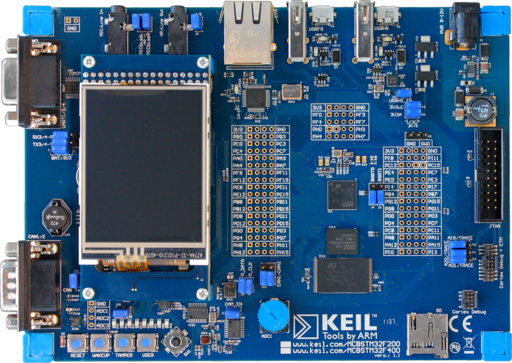
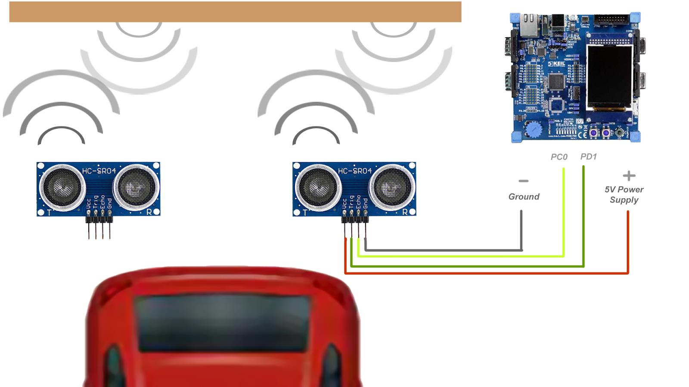
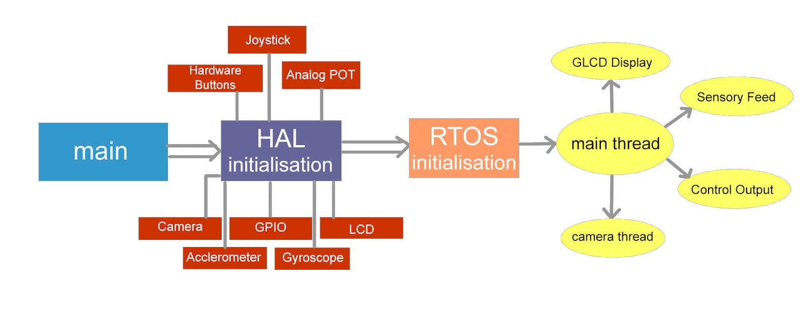

# Intelligent Embedded System Design under KEIL and ARM environment -

The objective was to understand the working of an Intelligent embedded system such as an ARM and KEIL based
microcontroller MCBSTM32F400 using Keil MDKARMTM (Microcontroller Development Kit) which features the
industry standard ARM compiler, the μVision®5 IDE, analysis
tools, and the fully functional Keil RTX RTOS.

Hence, by using the aforementioned microcontroller, an
intelligent parking system is designed which uses two ultrasonic
sensors (HCSR04) to sense the distance between the car and the objects
nearby for an efficient parking. It also uses it’s gyroscope and
camera for real time precision.

## KEIL MCBSTM32F400 Evaluation Board -

## Abstract of Intelligent Self Parking System

## Block Diagram of Operation

